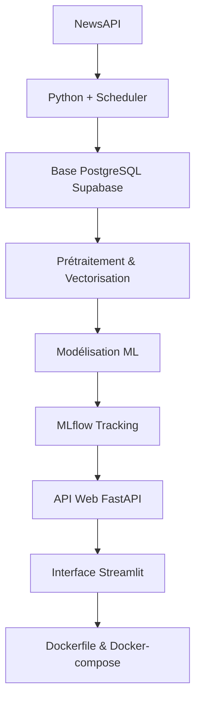

# 🔍 VeritaAI - Système de Détection de Fausses et Vraies Nouvelles


## 📋 Table des matières

- [🎯 Aperçu du projet](#-aperçu-du-projet)
- [🚀 Fonctionnalités](#-fonctionnalités)
- [🏗️ Architecture](#-architecture)
- [🔧 Technologies utilisées](#-technologies-utilisées)
- [📊 Modèles et performances](#-modèles-et-performances)
- [🛠️ Installation](#-installation)
- [💻 Utilisation](#-utilisation)
- [📈 Suivi des expériences](#-suivi-des-expériences)
- [🎯 Résultats](#-résultats)
- [🚫 Limitations](#-limitations)
- [🔮 Perspectives](#-perspectives)
- [👥 Contribution](#-contribution)
- [📄 Licence](#-licence)

---

## 🎯 Aperçu du projet

http://github.com/dona-eric/VeritaAI/blob/master/VeritaApp/assets/verita.png


La prolifération des fausses nouvelles ("fake news") représente une menace croissante pour l'information et la société. Ces contenus trompeurs peuvent manipuler l'opinion publique et semer la désinformation.

**Verita** est un projet conçu pour adresser ce problème en développant un système intelligent capable de détecter automatiquement les fausses nouvelles à l'aide d'algorithmes de machine learning. J'ai intégré MLflow pour un suivi, une comparaison et une gestion efficaces des expériences de modèles, assurant ainsi la reproductibilité et l'optimisation des performances.

---
### 🌟 Objectifs principaux

- Détecter automatiquement les fausses informations
- Fournir une interface intuitive pour l'analyse de textes
- Offrir un système de scoring de crédibilité
- Assurer une traçabilité complète des expériences ML

---

## 🚀 Mise en Place Technique

Cette section décrit les étapes clés de la mise en œuvre technique du projet.

### ✅ Fonctionnalités actuelles

- **Détection automatique** : Classification binaire (vrai/faux)
- **Interface utilisateur** : Application web Streamlit intuitive
- **Suivi MLflow** : Gestion complète des expériences
- **Modèles multiples** : Comparaison de 4 algorithmes différents
- **Prétraitement avancé** : Nettoyage et vectorisation TF-IDF
- **Devéloppement API** : Développé une api qui consomme les modèles de prédiction et affiche les résultats

### 🔄 En développement

- API REST pour intégration externe
- Détection multilingue
- Analyse de sentiment
- Système d'explication des prédictions

---

## 🏗️ Architecture



### 🔄 Flux de données

1. **Collecte** : Récupération d'articles via NewsAPI et Guardian
2. **Stockage** : Sauvegarde structurée en base PostgreSQL
3. **EDA** : Analyse exploratoire des données
3. **Prétraitement** : Nettoyage et vectorisation TF-IDF
4. **Entraînement** : Modèles ML avec suivi MLflow
5. **Evaluation** : Évaluer les modèles avec une validation croisée et sélection du meilleur modèle
5. **Mise en Production** : API web et interface utilisateur

---

## 🔧 Technologies utilisées

### 🐍 Backend & ML
- **Python 3.8+** : Langage principal
- **Scikit-learn** : Modèles de machine learning
- **XGBOOST**
- **MLflow** : Suivi et Gestion des expériences
- **Pandas, NumPy, Matplotlib** : Manipulation de données et Visualisation des données
- **NLTK** : Traitement du langage naturel

### 🌐 Frontend & API
- **Streamlit** : Interface utilisateur
- **FastAPI** : API REST
- **CSS/JavaScript** : Interface web

### 🗄️ Base de données
- **PostgreSQL** : Stockage principal
- **SQLAlchemy** : ORM Python

---

**Visualisation**


## 📊 Modèles et performances

### 🤖 Modèles entraînés

| Modèle | Accuracy | F1 Score |CV scores| Temps d'entraînement | Avantages | Rappel | AUC-ROC |
|--------|----------|----------|---------|----------------------|-----------|---------|---------|
| **MultinomialNB** | **97.88%** | **97.88%** | 98.00% | 6.4s | Simple,efficace sur texte | 97.98% | 99.84%|
| **Logistic Regression.** | 98.7% | 98.7% | 99.95% | 3.1min | Robuste, interprétable | 99.97% | 99.99%|
| **SVM (RBF)** | 99.3% | 99.3% | 🐌 Lent | Puissant, relations non-linéaires |
| **LinearSVC** | **99.98%** | **99.98%** |**99.97%** | **18.9s** | **Meilleur équilibre** | 99.978% | 99.998%|
| **RandomForest** | 98.91% | 98.91% | 98.95% | 2.3min | Lent | 98.91% | 99.9992%|
| **XGboost** | 99.967% | 99.967% | 99.956% | 21.3min | Trop Lent | 99.967% | 99.999% |

### 🏆 Modèles retenus : **LinearSVC**

**LinearSVC** a été sélectionné comme modèle de production pour :
- **Meilleurs Paramètres du modèles** : {"C":1, "loss":"squared_hinge", "max_iter":1000, "tool":0.001}
- **Performance exceptionnelle** : 99.5% de précision
- **Rapidité** : Temps d'inférence optimal
- **Scalabilité** : Adapté aux grandes volumes de données
- **Robustesse** : Excellent sur vecteurs TF-IDF

---
**Courbe d'apprentissage**


**Courbe ROC-AUC**


## 🛠️ Installation

### 📋 Prérequis

- Python 3.8+
- pip ou conda
- PostgreSQL (optionnel)

### 🔧 Installation rapide

```bash
# Cloner le repository
git clone https://github.com/dona-eric/VeritaAI.git
cd VeritaAI

# Créer un environnement virtuel
python -m venv venv
source venv/bin/activate  # Linux/Mac
# ou
venv\Scripts\activate  # Windows

# Installer les dépendances
pip install -r requirements.txt

# Initialiser la base de données 
python3 connect_database.py
# Pour lancer le pipeline de collecte de données et de sauvegarde 
python3 Data_collect/pipeline_connection_database_collect_data/pipeline_collect_data.py
```

### 📦 Dépendances principales

```txt
streamlit>=1.28.0
scikit-learn>=1.3.0
mlflow>=2.7.0
pandas>=1.5.0
numpy>=1.24.0
nltk>=3.8
psycopg2-binary>=2.9.0
scheduler
uvicorn
sqlalchemy
```

---

## 💻 Utilisation

### 🚀 Lancement rapide

```bash
# Lancer l'interface Streamlit
streamlit run VeritaApp/verita.py

# Lancer MLflow UI 
mlflow ui

# Entraîner les modèles
cd Final_Analysis
python3 modelisation.py   #pour la modelisation
```

### 🎯 Utilisation de l'interface

1. **Sélection du rôle** : Choisir entre User, Admin, Super-admin
2. **Authentification** : Se connecter avec ses identifiants
3. **Analyse** : Saisir un texte pour analyse
4. **Résultats** : Consulter la prédiction et le score de confiance

### 📝 Exemple d'utilisation

```python
from veritaai import FakeNewsDetector

# Initialiser le détecteur
detector = FakeNewsDetector()

# Analyser un texte
text = "Votre article à analyser..."
result = detector.predict(text)

print(f"Prédiction: {result['prediction']}")
print(f"Confiance: {result['confidence']:.2%}")
```

---

## 📈 Suivi des expériences

### 🔍 MLflow Tracking

Toutes les expériences sont trackées avec MLflow :

```python
import mlflow

# Démarrer une expérience
with mlflow.start_run():
    # Enregistrer les métriques
    mlflow.log_metric("accuracy", 0.995)
    mlflow.log_metric("f1_score", 0.995)
    
    # Enregistrer le modèle
    mlflow.sklearn.log_model(model, "model")
```

### 📊 Interface MLflow

Accéder à l'interface de suivi :
```bash
mlflow ui
# Ouvrir http://127.0.0.1:5000
```


---

## 🎯 Résultats

### 📈 Métriques clés

- **Accuracy globale** : 99.5%
- **Précision** : 99.4%
- **Rappel** : 99.6%
- **F1-Score** : 99.5%

### 🎭 Matrice de confusion (LinearSVC)

```
             Prédiction
Réel      Faux   Vrai
Faux     4695     0
Vrai       2   4426
```

### 🔍 Analyse des erreurs

- **Faux positifs** : 2 articles (0.5%)
- **Faux négatifs** : 0 articles (0.4%)
- **Principaux défis** : Articles satiriques, opinions subjectives

---

## 🚫 Limitations

### ⚠️ Limitations actuelles

- **Langue** : Uniquement en anglais pour le moment
- **Contexte** : Classification binaire simplifiée
- **Données** : Dépendant de la qualité du dataset d'entraînement
- **Biais** : Possible biais dans les sources d'entraînement
----

Les limites ne s'arretent pas à ceux cités 

### 🔄 Améliorations prévues

- Support multilingue
- Classification à plusieurs niveaux
- Détection de biais
- Amélioration continue du dataset

---

## 🔮 Perspectives

### 🚀 Roadmap

#### Phase 1 (En cours)
- [ ] API REST complète
- [ ] Système d'authentification avancé
- [ ] Interface d'administration

#### Phase 2 (Prochaine)
- [ ] Support multilingue
- [ ] Analyse de sentiment
- [ ] Détection de sources

#### Phase 3 (Future)
- [ ] IA explicable (SHAP, LIME)
- [ ] Détection en temps réel
- [ ] Intégration réseaux sociaux

---

## 👥 Contribution

### 🤝 Comment contribuer

1. **Fork** le projet
2. **Créer** une branche feature (`git checkout -b feature/FeatureVeritaAI`)
3. **Commit** vos changements (`git commit -m 'Add FeatureVeritaAI'`)
4. **Push** vers la branche (`git push origin feature/FutureVeritaAi`)
5. **Ouvrir** une Pull Request

### 📝 Guidelines

- Respecter le style de code (PEP 8)
- Ajouter des tests pour les nouvelles fonctionnalités
- Documenter les changements

---

## 📄 Licence

Ce projet est sous licence MIT. Voir le fichier [LICENSE](LICENSE) pour plus de détails.

---

## 👨‍💻 Auteur

**KOULODJI Dona Eric**
- 🐙 GitHub: [@dona-eric](https://github.com/dona-eric)
- 💼 LinkedIn: [dona-erick](https://linkedin.com/in/dona-erick)
- 📧 Email: donaerickoulodji@gmail.com

---

## 🙏 Remerciements

- **Équipe MLflow** pour l'excellent framework de tracking
- **Communauté Streamlit** pour l'interface intuitive
- **Contributeurs open source** pour les outils utilisés

---

## 📞 Support

Si vous avez des questions ou des problèmes :

1. 📚 Consultez la [documentation](docs/)
2. 🐛 Ouvrez une [issue](https://github.com/dona-eric/veritaai/issues)
3. 💬 Rejoignez nos [discussions](https://github.com/dona-eric/veritaai/discussions)

---

<div align="center">
  <p>
    <strong>⭐ N'hésitez pas à mettre une étoile si ce projet vous a aidé ! ⭐</strong>
  </p>
  <p>
    Made by <a href="https://github.com/dona-eric">KOULODJI Dona Eric</a>
  </p>
</div>